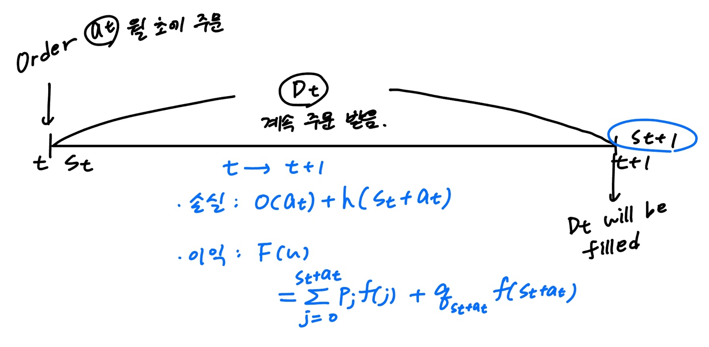

# 7. Examples of MDP Model

### One-Period MDP

- $T = \{1,2\}$로 단 두개 밖에 없을 때,  $g_1(s,a) + E[g_2(s')]$를 최대화시키는 작업.
- 만약 deterministic policy를 

## Single Product Stochastic Inventory Control

### 전체적인 메커니즘

- 

### Notations

- $S_{t+1} = \max(s_t + a_t - D_t , 0) = [s_t + a_t - D_t]^+$
  - $s_t$ : t시점에서의 재고 상황
  - $a_t$ : 공금되는 제품 수
  - $D_t$ : 수요, 임의적임.
  - 백로깅은 없다고 가정한다면, $s_t + a_t < D_t$인 경우, 나머지는 lost

### MDP 공식

- t시점에서 보상의 기댓값은 $g_t(s_t, a_t, s_{t+1}) = -o(a_t) - h(s_t + a_t) + f(s_t + a_t - s_{t+1})$
  - $O(u)$ : $u$를 주문하는데 드는 비용이며 고정비용인 $K$와 변동비용인 $C(u)$의 합으로 구성됨.
  - $h(u)$ : 한달 동안 u를 유지하는데 드는 유지비용
  - $r(u)$ : 월 말에 남아있는 재고인 $u$의 가치
  - $f(j)$ : 재고에서 $j$만큼 팔아서 얻게 되는 수익
- 이때, t시점에서 $s_{t+1}$은 모르므로, $f(s_t + a_t - s_{t+1}) = F(u)$로 대체하여 계산함.
  - $F(u) = \Sigma_{j=0}^{u-1} p_j f(j) + q_u f(u)$,  ($p_j$ : t시점에 j만큼의 수요가 발생할 확률, $q_u = \Sigma_{j=u}^{\infin}p_j = P(D_t \geq u)$ : 수요가 u를 초과할 확률)
  - 따라서 보상의 기댓값은 다음과 같이 대체할 수 있음.
    - $g_t(s,a) = F(s+a) - o(a) - h(s+a)\ \And \ g_N(s) = r(s)$
- $s$에서 $a$를 얻어 $s'$로 전이할 확률은 수요와 재고의 양을 비교하여 나타낼 수 있으며 다음과 같이 표현할 수 있음.
  - $p_t(s' | s,a) = \begin{cases} 0 & \mbox{if } M \geq s' \geq s+a \\ P_{s+a-s'} & \mbox{if }M \geq s+a>s'>0 \\ q_{s+a} & \mbox{if } M \geq s+a, s' = 0 \end{cases}$
- ex1) 만약 주문을 넣은 후에 수요 $D_t$가 들어온다면, 어떻게 MDP를 수정해야 할까?
  - $Q$ : 목표 재고량, $Q- \sigma$ : minimum fill
  - 만약 월 초 재고량이 $\sigma$수준 이하라면 $Q$단위로 올릴만한 충분한 양의 주문($Q-s$)을 넣음. 만약 $\sigma$ 단위 이상이라면 주문량은 교체하지 않음.
  - 따라서 고정정책은 다음과 같이 정할 수 있음.
    - $d(s) = \begin{cases} 0 & \mbox{if } S \geq \sigma \\ Q-s & \mbox{if }s < \sigma \end{cases}$
- ex2) 만약 부족한 수요가 백로깅 된다면? 즉 충분한 재고가 창고에 나중에 도착했을 때 충족시킬 수 있다면?
  - $s_t \in S = \{..,-2,-1,0,1,2,...,N\}$이며, 음수 index에 백로깅을 함.
  - $h(u)$를 음수 u에 대해서도 적용을 시킴. 
  - $u <0$인 경우는 unsatisfied demand에 대해서 패널티 비용을 지불함.
    - $h(u) = \begin{cases} -\phi u & \mbox{if } u <0 \\ \rho u & \mbox{if }u \geq 0\end{cases}$

## Optimal Stopping Problems

### 설명

- uncontrolled Markov Chain
  - 전이 확률이 action의 함수가 아님. state마다 2개의 액션만이 존재. (stop아니면  continue)
- 만약 t에서 멈춘다면 $r_t(s)$의 보상을 받음. 만약 t에서 진행한다면 $f_t(s)$의 비용이 발생함.
- 유한한 process이며, N시점에 상태 s에 있으면 보상 $h(s)$를 받음.
- 한번 멈추면 더 이상의 action과 reward는 없음.

### MDP 공식

- 보상은 다음과 같은 공식을 따름.
  - $g_t(s,a) = \begin{cases} -f_t(s) & \mbox{if } S \in S' , a = C \\ r_t(s) & \mbox{if }S \in S', a = Q \\ 0 & \mbox{if } s = \Delta \end{cases}$
  - $g_N(s) = \begin{cases} h(s) & \mbox{if } s \in S' \\ 0 & \mbox{if } s = \Delta \end{cases}$
- 상태 $s$에서 $s'$로 전이될 전이 확률은 다음과 같은 공식을 따름.
  - $P_t(s' | s, a) = \begin{cases} P_t(s'|s) & \mbox{if } s' ,s \in S' , a = C \\ 1 & \mbox{if }s \in S',s'=\Delta,a=Q \text{ or} \ s=s'=\Delta, a=C \\ 0 & \mbox{otherwise }\end{cases}$
- 중단 시점에서의 $r_t(s)$와 $\Sigma_{t=0}^{t-1} f_t(s)$간의 차이를 최대화하는 방향으로 진행됨.

## Controlled Discrete-Time Dynamic Systems

### What is the Controlled Dynamic Systems Approach?

- 전이 확률 대신에 smaple path와 system equation을 사용하여 설명함.
- 다음과 같은 system을 사용하여 설명
  - $s_{t+1} = f_t(s_t, a_t, w_t)$
  - $w_t \in W$이며, $w_t$는 t시점에서의 랜덤 방해 변수
- $\{s_1, s_2, .., \}$ state 시퀀스는 아래의 요인들로 인해 방해를 받음.
  - 통제 하의 변수들 (actions) : $\{a_1, a_2, ... \}$
  - 통제 외의 변수들 (w) : $\{w_1, w_2,...\}$, 
    - $w_t$는 $w_{\tau}, \ (\tau < t)$와 독립적이며, $q_t(.)$는 $W_t$의 확률밀도함수이며, $s_t$, $a_t$와 독립적임.
- t시기에 보상 $g_t(s_t, a_t)$를 받으며, 마지막 시점에서의 보상은 $g_N(s_N)$임.

### MDP formulation

- 보상은 $g_t(s,a)(t < N)\ \And \ g_N(s_N)(t=N)$으로 계산.
- 전이확률은 다음과 같이 계산함.
  - $p_t(s' | s,a) = p(s' = f_t(s,a,w_t)) = \underset{w \in W_t, s' = f_t(s,a,w)}{\Sigma} q_t(w)$.

### Difference between MDP and Controlled discrete-time dynamic systems

- MDP는 $s_t, a_t$에 정의되는 전이확률을 사용해서 시스템이 운행됨.
- Controlled discrete-time dynamic system은 $s_{t+1} = f_t(s_t, a_t, w_t)$로 정의된 시스템을 다루는 전이확률이 교란변수 $w_t$의 분포로부터 도출됨.

### Economic Growth Model

- 자본의 투자나 소비에 대한 계획경제에 대한 확률적 역할 모델.
- t시기에 사용가능한 자본의 수준을 관찰하여 얼만큼 소비할 것인지($a_t$)를 선택하고, 남은 자본($s_t-a_t$)을 투자함.
- 소비하자마자 즉각적으로 $\varphi_t(a_t) (= g_t(s,a))$의 효용을 만들어내며, 그 다음 단계의 자본인 $s_{t+1}$은 아래 공식을 통해 만들어짐.
  - $s_{t+1} = w_tF_t(s_t -a_t)$
  - $F_t$ : 현재 남은 자본에 대한 기대 수익, $w_t$ : 교란변수

- 전이확률은 다음과 같이 계산됨.
  - $p_t(s' | s,a) = P(s' = w_tF_t(s-a)) = \underset{w \in W_t, s' = wF_t(s-a)}{\Sigma} q_t(w)$

