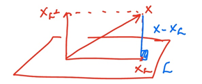

# 03. Orthogonal Projection

## 3-1. Orthogonal projection (정사영)

### 정리 1

$\R ^n$에 포함되는 부분집합 $\mathcal{L}$에 대해서, $\mathcal{L}$의 직교 여공간(Orthogonal Complement)는 다음과 같이 정의됨.

- $\mathcal{L}^{\bot}= \{\text{x} \in \R^{n} : \text{x}^T \text{y} = 0 \ \ \forall \text{y} \in \mathcal{L}  \}$

- $\mathcal{L}^{\bot}$은 $\R^n$의 부분집합이며, $\mathcal{L}$과  $\mathcal{L}^{\bot}$은 교집합이 없음.  $(\mathcal{L} \cap \mathcal{L}^{\bot} = \{0\})$

  - > 📌 직교 여공간은 무조건 벡터형태인가? 면과 면이 직교할 수도 있을텐데..?
    >

### 정리 2

$\R^n$에 속하는 $\text{x}$는 아래와 같이 표현될 수 있음.

- $\text{x} = \text{x}_{\mathcal{L}} + \text{x}_{\mathcal{L^{\bot}}}$
- 이때, $\text{x}_{\mathcal{L}} \in \mathcal{L} \and \text{x}_{\mathcal{L^{\bot}}} \in \mathcal{L^{\bot}}$
- $\text{x}_{\mathcal{L}}$를 $\mathcal{L}$에 대한 $\text{x}$의 직교사영이라고 함.

$\mathcal{L}$에 속하는 모든 $\text{y}$에 대하여 $||\text{x}-\text{x}_{\mathcal{L}}||_2 \leq ||\text{x} - \text{y}||_2$

- 

### 정리 3

만약 $A^2 = A$라면, $\R^{n \times n}$에 속하는  행렬 A를 멱함수(idempotent, projection) 행렬이라고 함.

- (1) $\text{Ax}$는 $\R^n$에 속하는 모든 $\text{x}$의 $\mathcal{C}(A)$에 대한 직교 투영임.
- (2) $A$는 사영이고, $\mathcal{N}(A) \bot \mathcal{C}(A)$이며, $\text{x}\in \mathcal{N}(A) \and \text{y} \in \mathcal{C}(A)$인 $\text{x}, \text{y}$에 대해서 $\text{x}^T \text{y}=0$임.
- (3) $A$는 대칭이고 멱함수임.

만약 위 중 하나가 성립하면, A를 $\mathcal{C}(A)$에 대한 직교사영 행렬이라고 함.

### 정리 4

$\mathbf{A}$가 Symmetric이라 가정할 때 아래 조건들을 만족한다.

- $\mathbf{A}^2 = \mathbf{A}$

- $\text{det}(\mathbf{A}) = 0 \ \text{or} \ 1$

- $\text{rank}(\mathbf{A}) + \text{rank}(\mathbf{I_n-A})=n$

  - > 📌 왜 이게 특징이지? 당연한 내용 아닌가?

추가로, 위의 조건들은 아래 내용들을 암시한다.

- $\text{rank}(\mathbf{A}) = \text{tr}(\mathbf{A})$

  - > 📌 trace가 뭐지?

- $\mathbf{I}_n-\mathbf{A}$는 $\mathcal{C}^{\bot}(\mathbf{A})=\mathcal{N}(\mathbf{A})$로 정사영된다.

  - > 📌 column space, null space가 뭐지?
    >
    > 📌 왜 $\mathcal{C}^{\bot}(\mathbf{A})=\mathcal{N}(\mathbf{A})$ 이거지?
    >
    > 📌 $\mathbf{I}_n-\mathbf{A}$가 어떤 의미를 갖지?

### 정리 5

$\mathbf{A+B}$가 정사영이다 $\Leftrightarrow$ $\mathcal{C}(\mathbf{A}) \bot \mathcal{C}(\mathbf{B})$인 경우 아래 경우들을 만족한다.

- $\mathcal{C}(\mathbf{A}+\mathbf{B})=\mathcal{C}(\mathbf{A}) + \mathcal{C}(\mathbf{B})$
- $\mathcal{N}(\mathbf{A}+\mathbf{B}) = \mathcal{N}(\mathbf{A}) \cap \mathcal{N}(\mathbf{B})$
- $(\Rightarrow)$ 증명
  - $(A+B)^2=A+B \Rightarrow AB + BA = 0$
  - $0 = AB+BA = A^wB+ABA = AB+ABA= AB(I+A)=0$
  - 따라서 $AB=0$이므로 orthogonal projection
- $(\Leftarrow)$ 증명
  - $(A+B)^2 = A^2 + B^@ + AB+BA$
  - $= A+B+AB+BA$($A^2=A$이므로)
  - $=A+B$ ( $\mathcal{C}(A) \bot \mathcal{C}(B)$이므로)

### 정리 6

$\mathbf{AB}$가 정사영이다 $\Leftrightarrow$ $\mathbf{AB} = \mathbf{BA}$인 경우 아래 경우들을 만족한다.

- $\mathcal{C}(\mathbf{AB}) = \mathcal{C}(\mathbf{A}) \cap \mathcal{C}(\mathbf{b})$
- $\mathcal{N}(\mathbf{AB}) = \mathcal{N}(\mathbf{A}) + \mathcal{N}(\mathbf{B})$

- $(\Rightarrow)$ 증명
  - $(\mathbf{AB})^T = \mathbf{AB} = \mathbf{B}^T \mathbf{A}^T = \mathbf{BA}$

- $(\Leftarrow)$ 증명
  - $\mathbf{A}, \mathbf{B}$는 symmetric and idempotent 하므로
  - $(\mathbf{AB})^2 = \mathbf{A}\mathbf{B}\mathbf{A}\mathbf{B} = (\mathbf{A}\mathbf{A})(\mathbf{B}\mathbf{B})=\mathbf{AB}$

### 정리 7

### 정리 8

$X$가 $(\mathbf{x}_1,\mathbf{x}_2,...,\mathbf{x}_p)$인 $n \times p$ 행렬이며, $\text{rank}(X)=p$이고, $H = X(X^TX)^{-1}X^T$라고 하자. $H$는 $\mathcal{C}(X)$의 정사영이다. 이때 아래 조건들을 만족한다.

- $H^2=H$
- $\mathcal{C}(H) \bot \mathcal{N}(H)$
- $\mathcal{C}(H)=\mathcal{C}(X)$

만약 $Y$가 $n \times p$ 행렬이고, $\mathcal{C}(Y)=\mathcal{C}(X)$라고 하면, $X(X^TX)^{-1}X^T=Y(Y^TY)^{-1}Y^T$

